<!DOCTYPE html>
<html>
<head>
	<meta http-equiv="content-type" content="text/html; charset=utf-8"/>
	<title></title>
	<meta name="generator" content="LibreOffice 7.5.7.1 (Windows)"/>
	<meta name="created" content="2021-12-08T21:08:42.611000000"/>
	<meta name="changed" content="2021-12-08T23:56:24.493000000"/>
	
</head>
<body lang="en-GB" link="#000080" vlink="#800000" dir="ltr"><h1 class="western">
Torsion of open sections</h1>
<h2 class="western">NB.2 Internal forces due to torsion</h2>

 

Effects of St.Venant
torsion can be neglected in sense of 6.2.7.(7) of EN1993-1-1 in case
of open sections. When transverse loading on a beam of an open
section is applied with the eccentricity from the shear centre the
components of internal forces associated with torsion can be
determined as:

<table width="643" cellpadding="4" cellspacing="0">
	<col width="210"/>

	<col width="415"/>

	<tr valign="top">
		<td width="210" style="background: transparent; border-top: 1px solid #000000; border-bottom: 1px solid #000000; border-left: 1px solid #000000; border-right: none; padding-top: 0.97mm; padding-bottom: 0.97mm; padding-left: 0.97mm; padding-right: 0mm">

			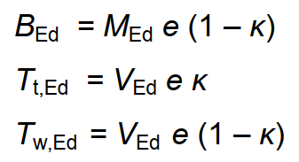

			

			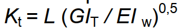

			

			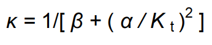

		</td>
		<td width="415" style="background: transparent; border: 1px solid #000000; padding: 0.97mm">

			where

			
<i>B</i><i>Ed		</i>bimoment

			
<i>T</i><i>t,Ed</i>		moment
			due to St’Venant torsion

			
<i>T</i><i>w,Ed</i><i>		</i>moment
			due to warping torsion

			
<i>M</i><i>Ed</i>		bending
			moment

			
<i>V</i><i>Ed</i>		shear
			force

			

			 

			

		</td>
	</tr>
</table>

k		coefficient
taking in to account the effect of    St’Venant stiffness of the
cross- 			section. It is a function of a non-dimensional parameter in
torsion <i>K</i><i>t</i>.

 

<i>M</i><i>Ed 
</i>and<i> V</i><i>Ed
 </i>is moment and shear force
due to the transverse loading determined for a given member. These
are determined for transverse loading with respect to the boundary
condition at beam ends.

 

Coefficients
a and b
take in to account the type of loading and boundary conditions:

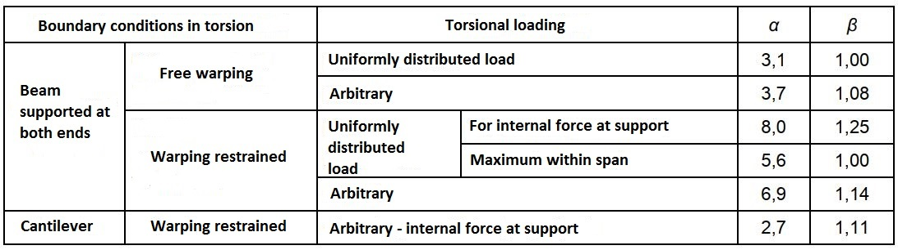

 

In
the case of a beam simply supported on both sides, the effect of
St’Venant torsion can be neglected when <i>K</i><i>t</i>
≤ 1 (<i>T</i><i>t,Ed</i>), while for <i>K</i><i>t</i>
≥ 15 the warping torsion components (<i>B</i><i>Ed</i>,
<i>T</i><i>w,Ed</i>) can be neglected.

 

<h2 class="western">NB.3 Elastic critical moment</h2>

The procedure is
suitable for calculation of the critical moment of beams of constant
cross-section of bi-axially symmetric cross-section, cross-sections
symmetric about major axis (z) only, and a cross-section symmetric
about minor axis (y) when loading passes trough the shear centre.

 

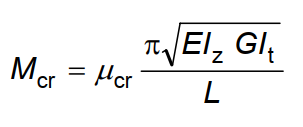

 

where
non-dimensional critical moment is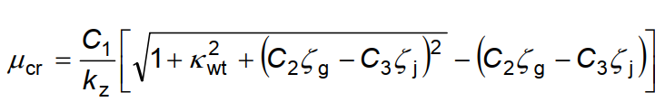

Non-dimensional
parameter in torsion is

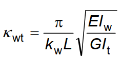

non-dimensional
parameter involving point of application of loading with respect to
the shear centre:

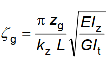

non-dimensional
parameter of section assymmetry:

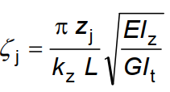

C1, C2, C3 are
coefficients accounting for loading types and end conditions, see
following tables,

L is length of a
beam between points where out-of plane movement is restrained,

kz and kw are
buckling length coefficients,

zg = za – zs

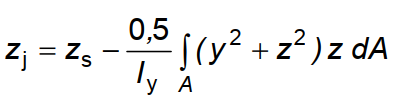

For sections
symmetrical about y-y axis zj = 0.

 

za	point of load
application with respect to the centre of gravity

zs	coordinate of a
shear centre with respect to the centre of gravity

zg	coordinate of
load application with respect to the shear centre

 

For I-section with
asymmetric flanges:

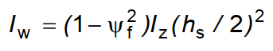

hs 	is a distance
between the shear centres of flanges

parameter of
cross-section asymmetry:

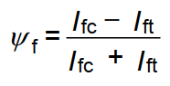

where

Ifc	second moment of
inertia of the compressed flange about the minor axis of the
cross-section,

Ift	second moment of
inertia of the tension flange about the minor axis of the
cross-section

 

The buckling length
coefficients ky, kz (describing the boundary conditions in bending)
and kw (describing the torsional boundary conditions) vary from 0.5
for both ends fixed to 1.0 for the hinge

for both ends, with
a value of 0.7 for one end fixed and the other hinged.

 

The coefficient ky
refers to the end rotation in the plane perpendicular to the y-y
axis, the coefficient kz refers to to the end rotation in the plane
perpendicular to the z-axis. These coefficients are analogous to the
ratio Lcr/L of a compressed member. The factor kw relates to the end
warping. Unless a special measure to prevent warping is applied, k =
1.0 may be taken.

 

The values of C1, C2
and C3 are given in Tables NB.3.1 and NB.3.2 for different load cases
which are defined by the bending moment along the length L between
the points secured against transverse buckling. The values are given
as a function of the coefficient kz and, in Table NB.3.2, of the
coefficient kw.

 

In cases where kz =
1.0, the coefficient C1 can be used for any ratio of end moments
according to the table NB.3.1 can be determined approximately by the
relation:

 

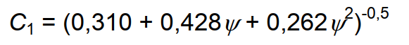

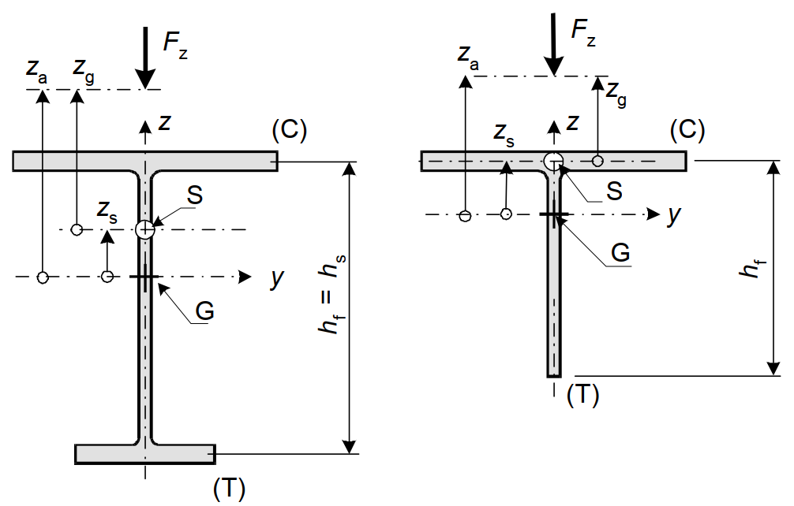

(T)
for tension part, (C) for compressed part, S for shear centre, G for
centre of gravity

<h2 class="western" align="center"><b>F</b><b>igure</b>
NB.3.1 - Sign convention and definitions when applying the load Fz</h2>

 

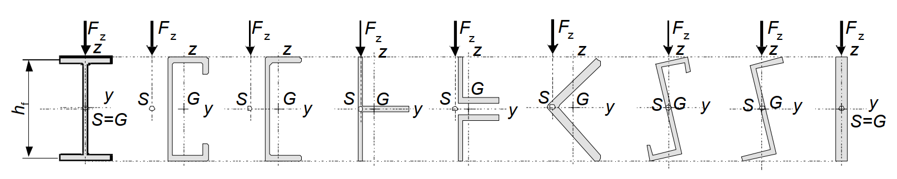

<h2 class="western" align="center"><b>F</b><b>igure</b>
NB.3.2 - Cross-sections symmetrical to the major axis or bi-axially
symmetrical</h2>

The sign convention
for determining z and zj, see Figure NB.3.1, is:

[1] the z coordinate
is positive for the compressed flange. When zj is determined using
the relation in NB.3.2(1), it points the z-axis upwards in the case
of a gravity load. The z-axis points downwards in the case of a
suction load;

[2] the sign of zj
is the same as the sign of the cross-sectional asymmetry coefficient
ψ

 

The sign convention
for zg is:

[1] for load effects
zg is positive when the load is applied above the centre of shear;

[2] in the general
case zg is positive when the load is directed from the point of
action to the centre of shear

<h2 class="western">Table NB.3.1 - Values of the coefficients C1 and
C3 when loading the member with end moments depending on the value of
the coefficient kz and the coefficients ψf and κwt</h2>

Coefficient of the end conditions of member in plane of bending ky
= 1.0, in warping kW = 1.0

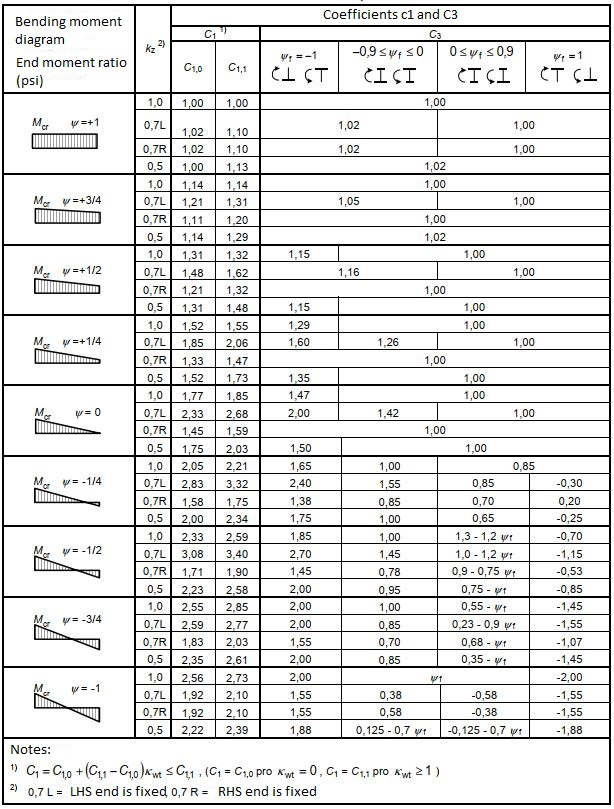

 

 

<h2 class="western">Table NB.3.2 - C1, C2 and C3 coefficient values
for different transverse load cases depending on on the value of the
coefficients k y, kz, kw and the coefficients ψf and κwt</h2>

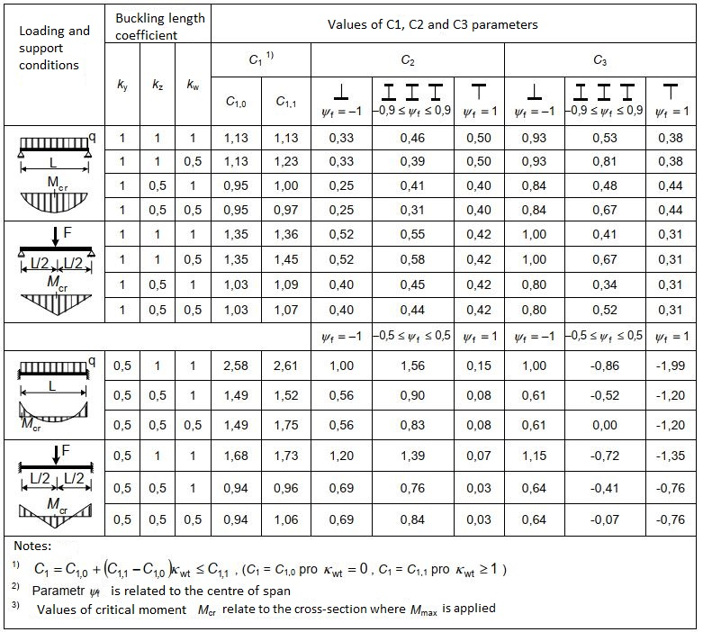

 

 

 

 

 

</body>
</html>